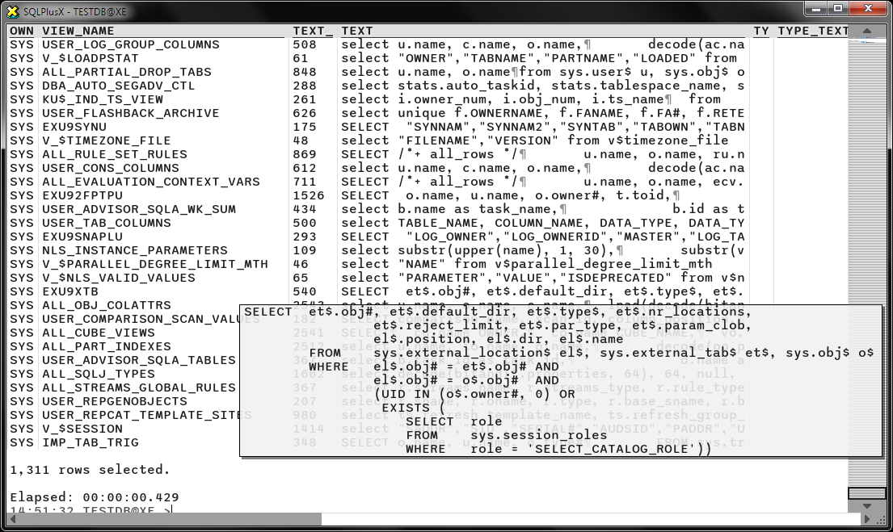

# Gallery

SQLPlusX provides color feedback for incomplete transactions based on the row count.
When (and only when) one row is affected, this shows the feedback as green.  If over
one hundred rows are affected, the feedback row flashes red.

After commit the rows become the regular text color to indicate they are now a permanent
part of the history.  If a rollback occurs, they become grey.

SQLPlusX has auto complete on internal commands.

Autocomplete includes tables and columns in SQL.

SQLPlusX emulates the look and feel of a command line, but is actually rendered on live data.
This means columns can dynamically size according to the available space.

SQLPlusX supports CLOB fields.  If a CLOB column is in the SELECT list, its contents are 
downloaded for you.

If the data is truncated for the screen (CLOB or otherwise), the source can still be seen on rollover.

All queries are executed on a worker thread, leaving the UI free and never blocking your workflow.
If a long running query is in progress you can cancel at any time with Escape or type in a follow 
up statement.  These build up in a command queue.

Describe package applies syntax highlighting.

Describe has also been enhanced to support some other object types.

Describe table shows comments.

Execute and PL/SQL work as expected.

The Host command directs the output into the buffer.

Show all includes new client settings as well as old backwards compatible options.

Error messages provide the surrounding context and highlight the problem area.

If the failing statement is from a script file, the line number is correctly calculated for you.

The new Source command provides syntax highlighted output on packages and views.

